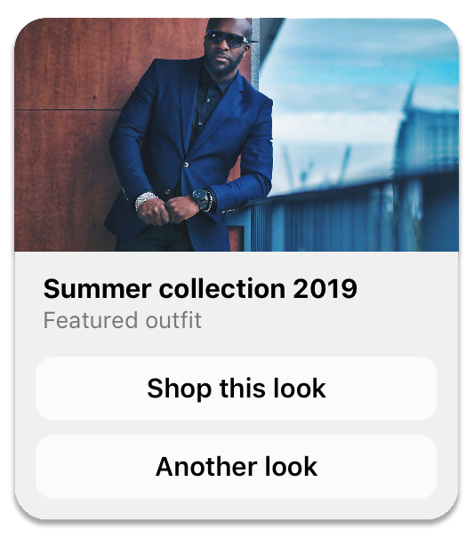
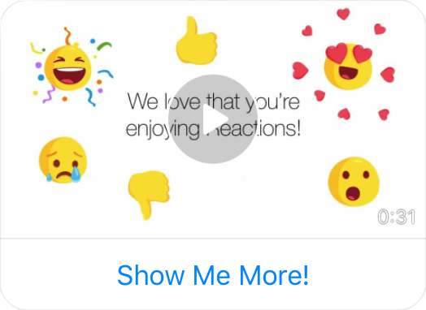
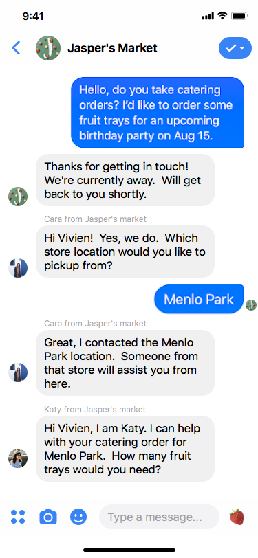

# Facebook Messenger Bot

A PHP library streamlining the integration and smooth utilization of the Messenger API for the development of interactive chatbots.

[](https://packagist.org/packages/fakellyh/bot-messenger-php) [](https://packagist.org/packages/fakellyh/bot-messenger-php) [](https://packagist.org/packages/fakellyh/bot-messenger-php) [](https://packagist.org/packages/fakellyh/bot-messenger-php) [](https://packagist.org/packages/fakellyh/bot-messenger-php)

# Getting Started

## Installation

It is better to use composer :

```bash
composer require fakellyh/bot-messenger-php
```

# Usage

## Add the autoloader

```php
require_once __DIR__.'/vendor/autoload.php';
```

## Create a Messenger instance

```php

use Fakell\BotMessenger\Client;
use Fakell\BotMessenger\Messenger;

$client = new Client('<PAGE_TOKEN>');
$messenger = new Messenger($client);

// Or quick instance

$messenger = Messenger::create('<PAGE_TOKEN>');

```

## Send text message to user

```php
$messenger->sendMessage(<USER_ID>, "Hello world");
```

## Set action status


```php
use Fakell\BotMessenger\Messenger;
use Fakell\BotMessenger\Types\ActionType;

$messenger = Messenger::create(<PAGE_TOKEN>);
// Mark seen last message
$messenger->setActionStatus(<USER_ID>, ActionType::MARK_SEEN);
// Set typing on
$messenger->setActionStatus(<USER_ID>, ActionType::TYPING_ON);
// Set typing off
$messenger->setActionStatus(<USER_ID>, ActionType::TYPING_OFF);

```

See [here](https://developers.facebook.com/docs/messenger-platform/send-messages/sender-actions) for best practice.

## Send message with quick reply


```php
use Fakell\BotMessenger\Messenger;
use Fakell\BotMessenger\Model\Message;
use Fakell\BotMessenger\Model\QuickReply\Text;
use Fakell\BotMessenger\Model\QuickReply\UserEmail;
use Fakell\BotMessenger\Model\QuickReply\UserPhoneNumber;

$messenger = Messenger::create(<PAGE_TOKEN>);
$message = new Message("Pick a size:");
$message->setQuickReplies([
    new Text("Small", "YOUR_PAYLOAD", "https://image.com"),
    new Text("Medium", "YOUR_PAYLOD"), // image url can be null
    // You can use too UserPhoneNumber and UserEmail to detect automaticly these value
    new UserPhoneNumber(),
    new UserEmail(),
])

$messenger->sendMessage(<USER_ID>, $message);

```

## Send Template Message

### Generic Template



```php
use Fakell\BotMessenger\Messenger;
use Fakell\BotMessenger\Model\Attachment\Template\Generic\Generic;
use Fakell\BotMessenger\Model\Attachment\Template\Generic\GenericElement;
use Fakell\BotMessenger\Model\Message;

$messenger = Messenger::create(<PAGE_TOKEN>);

// Cannot exceed 10 GenericElement
$genericElement = [
    new GenericElement(
        "Summer collection 2019",
        "Featured outfit",
        "https://myimage.com/image.png"
    ),
    new GenericElement(
        "Other title",
        "I don't know",
        "https://myimage.com/image2.png", // image url can be null
    ),
];

$template = new Generic($genericElement);
$message = new Message($template);

// You add quick reply if needed
// $message->addQuickReply(...)

$messenger->sendMessage(<recipient>, $message);
```

### Button Template


```php
use Fakell\BotMessenger\Messenger;
use Fakell\BotMessenger\Model\Attachment\Template\Button\Button;
use Fakell\BotMessenger\Model\Button\PhoneNumber;
use Fakell\BotMessenger\Model\Button\Postback;
use Fakell\BotMessenger\Model\Button\WebUrl;
use Fakell\BotMessenger\Model\Message;

$messenger = Messenger::create(<PAGE_TOKEN>);

// Check the namespace carefully  Fakell\BotMessenger\Model\Attachment\Template\Button\Button
$button = new Button("What can I do to help?",
    [
        new Postback("Get Order Satuts", "YOUR_PAYLOaD"),
        new PhoneNumber("Call Me", "+261340226111"),
        //Button can be WebUrl
        new WebUrl("Go to my site", "https://mysupersite.com")
    ]
);

$message = new Message($button);

// You add quick reply if needed
// $message->addQuickReply(...)

$messenger->sendMessage(<recipient>, $message);
```

### Media Template

 

```php
use Fakell\BotMessenger\Messenger;
use Fakell\BotMessenger\Model\Attachment\Template\Media\Media;
use Fakell\BotMessenger\Model\Button\Postback;


$messenger = Messenger::create(<PAGE_TOKEN>);

$media = new Media(Media::TYPE_IMAGE, <attachment_id or facebook url>, [
    new Postback("I want some!")
    // 3 button max or []
])

// Just change Media::TYPE_VIDEO for video media

$message = new Message($button);

// You add quick reply if needed
// $message->addQuickReply(...)

$messenger->sendMessage(<recipient>, $message);
```

### Receipt Template


```php
use Fakell\BotMessenger\Messenger;
use Fakell\BotMessenger\Model\Message;
use Fakell\BotMessenger\Model\Attachment\Template\Receipt\Address;
use Fakell\BotMessenger\Model\Attachment\Template\Receipt\Receipt;
use Fakell\BotMessenger\Model\Attachment\Template\Receipt\Summary;
use Fakell\BotMessenger\Model\Attachment\Template\Receipt\Adjustment;
use Fakell\BotMessenger\Model\Attachment\Template\Receipt\RecieptElement;

$messenger = Messenger::create(<PAGE_TOKEN>);

$receiptElements = [
    new RecieptElement("Classic White T-Shirt", 450, "100% Soft and Lu..", 2, "USD", "https://image.com/withe.png"),
    new RecieptElement("Classic Gray T-Shirt", 600, "100% Soft and Lu..", 1, "USD", "https://image.com/gray.png"),
];

$summary = new Summary(56.14);
$receipt = new Receipt("FIOMBONANTSOA Nombana Fahendrena", "N°001", "USD", "VISA 1232135", $receiptElements, $summary);


// Adjustement and Address is optional you can skip this if not needed
$adjustement = [
    new Adjustment("Transportation costs", 20),
    new Adjustment("Bus trasport costs", 5)
];
$adress = new Address("Miami", "city name", 20012, "State", "Madagascar", "SecondStreet or Null");
$receipt->setAdjustments($adjustement);
$receipt->setAddress($adress);

$message = new Message($receipt);

$messenger->sendMessage(<USER_ID>, $message);
```

## File, Image, Video, Audio Attachment

```php
use Fakell\BotMessenger\Messenger;
use Fakell\BotMessenger\Model\Attachment\Audio;
use Fakell\BotMessenger\Model\Attachment\File;
use Fakell\BotMessenger\Model\Attachment\Image;
use Fakell\BotMessenger\Model\Attachment\Video;
use Fakell\BotMessenger\Model\Message;

$messenger = Messenger::create(<PAGE_TOKEN>);

// Image

// Locale file
$image = new Image("./image.png");
// or remoteFile
$image = new Image("https://image.com/fakell.png");

// I don't write in the following code the file remote from others because Image, File, Audio, Video supports a remote file
// Note that it is better to use a local file

// File
$file = new File("./myfile.txt");

// Audio
$audio = new Audio("./mysong.mp3");

// Video
$video = new Video("./myvideo.mp4");

$message = new Message($image); // You can change $image per $file, $audio, $video

$messenger->sendMessage(<USER_ID>, $message);

```

## Personas



### Personas management

```php
use Fakell\BotMessenger\Messenger;
use Fakell\BotMessenger\Model\Personas\Personas;

$messenger = Messenger::create(<PAGE_TOKEN>);

// Add personas

$personas = new Personas("Fakell", "https://image.com/profile.png");
$messenger->addPersonas($personas); // if successful, this will return an array containing the personas's id

// Get one personas info
$personas = $messenger->getPersonas(<PERSONAS_ID>);

// Get All personas, this will return an array Personas[]
$personasList = $messenger->getAllPersonas();

// Delete personas
$messenger->deletePersonas(<PERSONAS_ID>);

```

### Personas Usage

```php
use Fakell\BotMessenger\Messenger;

$messenger = Messenger::create(<PAGE_TOKEN>);

// Just by specifying in the third argument the id of the presonas
// You can also use in Attachment type
$messenger->sendMessage(<USER_ID>, "Hello", <PERSONAS_ID>);
```

## Messenger Options

### Persistent Menu


```php
use Fakell\BotMessenger\Messenger;
use Fakell\BotMessenger\Model\Button\Postback;
use Fakell\BotMessenger\Model\Button\WebUrl;
use Fakell\BotMessenger\Model\MessengerProfile\PersistentMenu\PersistentElement;
use Fakell\BotMessenger\Model\MessengerProfile\PersistentMenu\PersistentMenu;
use Fakell\BotMessenger\Types\MessengerAndroidLocales;

$elements = [
    // This is used by default if the language is not defined on the list
    new PersistentElement(
        [
            new Postback("Talk To an Agent", "YOUR_PAYLOAD"),
            new Postback("Outfit suggestions", "YOUR_PAYLOAD"),
            new WebUrl("Shop now", "https://ourwebsite.com"),
            // ...
        ],
        MessengerAndroidLocales::DEFAULT
    ),
    // This is used if the language is French
    new PersistentElement(
        [
            new Postback("Parler à un agent", "YOUR_PAYLOAD"),
            new Postback("Suggestions de tenues", "YOUR_PAYLOAD"),
            new WebUrl("Acheter maintenant", "https://ourwebsite.com/fr"),
            // ...
        ],
        MessengerAndroidLocales::FR_FR
    ),
    // See more in MessengerAndroidLocales or MessengerLocales
];

$persistentMenu = new PersistentMenu($elements);

$messenger->setMessengerOptions($persistentMenu);
```

### Greeting

You can personalize the greeting text using the person's name. You can use the following template strings:

- `{{user_first_name}}`
- `{{user_last_name}}`
- `{{user_full_name}}`

```php
use Fakell\BotMessenger\Messenger;
use Fakell\BotMessenger\Model\MessengerProfile\Greeting\Greeting;
use Fakell\BotMessenger\Model\MessengerProfile\Greeting\GreetingElement;
use Fakell\BotMessenger\Types\MessengerAndroidLocales;

$messenger = Messenger::create(<PAGE_TOKEN>);

$elements = [
    // Default
    new GreetingElement("Welcome to my super page {{user_full_name}}"),
    // French Language
    new GreetingElement("Bienvenue sur ma super page {{user_full_name}}", MessengerAndroidLocales::FR_FR),
    // Spanish Language
    new GreetingElement("Bienvenido a mi súper página {{user_full_name}}", MessengerAndroidLocales::ES_ES),
    // and more ...
];

$greeting = new Greeting($elements);
$messenger->setMessengerOptions($greeting);
```

### Get Started Button


```php
use Fakell\BotMessenger\Messenger;
use Fakell\BotMessenger\Model\MessengerProfile\GetStarted\GetStarted;

$messenger = Messenger::create(<PAGE_TOKEN>);

$getStarted = new GetStarted("YOUR_PAYLOD");

$messenger->setMessengerOptions($getStarted);

```

# Support

If you think there is an actual problem in this library, please [open](https://github.com/fakellgit/bot-messenger-php/issues/new) an issue if there isn't one already created.

## Author
Nombana Fahendrena FIOMBONANTSOA
[fakellyh@gmail.com](mailto:fakellyh@gmail.com)
[Facebook](https://www.facebook.com/fakellyh)

# License

MIT
